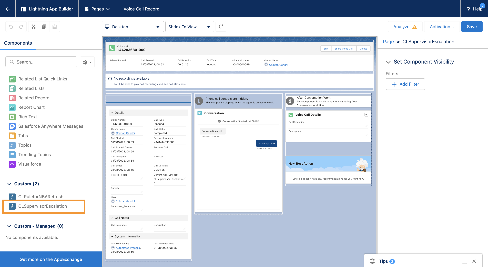

### Salesforce Configuration

This section covers configurations on Salesforce side. As we have seen in the previous section, AWS configurations enable updating custom field in Voice Call object whenever Contact Lens real-time rule is matched. Post this, a series of actions will be executed in Salesforce to trigger supervisor escalation by raising a flag from agent screen.

**Important Notes**:

1. The code for this example is for non-production use only
2. For Salesforce APIs and Platform Events' volume considerations and limitations, please contact Salesforce

### Salesforce Package

In order to enable Contact Lens driven automated supervisor escalation following Salesforce components need to be installed in your Salesforce org:

1. **Auto_Supervisor_Escalation\_\_c** - This is a custom field in Voice Call object which will be updated when Amazon Connect Contact Lens rule matches for supervisor escalation
2. **Supervisor Escalation** - This is a Process Automation flow which will be triggered whenever Auto_Supervisor_Escalation field changes and generates Platform Event
3. **clrtsupescalate** - This is a Platform Event which will be generated by Generate CL Platform Event flow
4. **CLSupervisorEscalation** - This is Aura UI component which will trigger API to raise the flag whenever there is a Platform Event clrtsupescalate. This component needs to be added to Voice Call Record Page

To install above Salesforce components, you need to install Salesforce Package called - CLForAutoSupEsc. This is un-managed package created only for learning or lab use (**Only for non-production use only**).

**Steps**

1. Click on this link - https://login.salesforce.com/packaging/installPackage.apexp?p0=04t8d000000E5mb
2. Enter your Salesforce credentials
3. For Package Password : SCVAsset123
4. Leave everything else as is and click on Install
5. You should see a success message in a few minutes

### Salesforce Voice Call Record page

As we discussed, in the Agent Experience section, Voice Call Record page works as agent workspace.There is a custom UI component which needs to be added on the Voice Call Record page.

**Steps**

1. From Setup, enter Lightning App Builder in the Quick Find box, then select **Lightning App Builder**
2. Click Edit for Voice Call Record Page, which will open Lightning App Builder
3. From the left panel, Components, scroll down till you find **CLSupervisorEscalation** in Custom section and drag and drop **CLSupervisorEscalation** on right section of Voice Call Record page
4. Save your work, then click **Activation**
5. Review the app default assignments, and then save your work. The record page is now available in the Lightning Service Console.

**Next** - [Test use case](./deployment_test.md)
